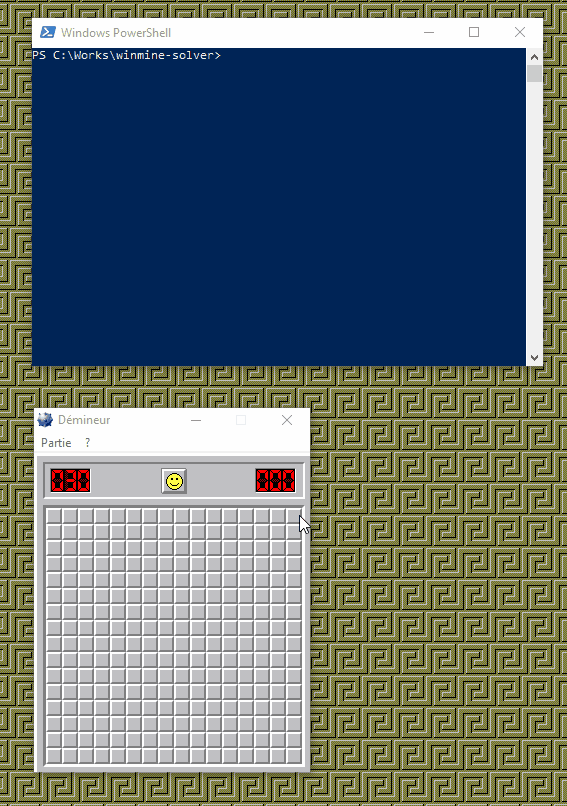

# Winmine solver #

## Prerequisites ## 

- This script requires a winmine from an old version of Windows.

- Installation of dependencies
```
> npm install
```
### Dependencies ###
```
robotjs:^0.5.1
```

## How to use ## 

When a winmine game is started and you are locked, just start the script.
```
> node index
```
It will move the mouse and click on winmine boxes until the game end.




